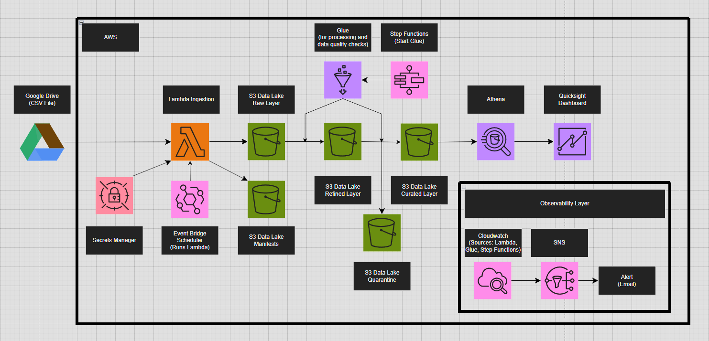
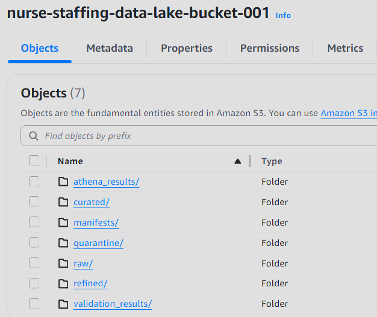
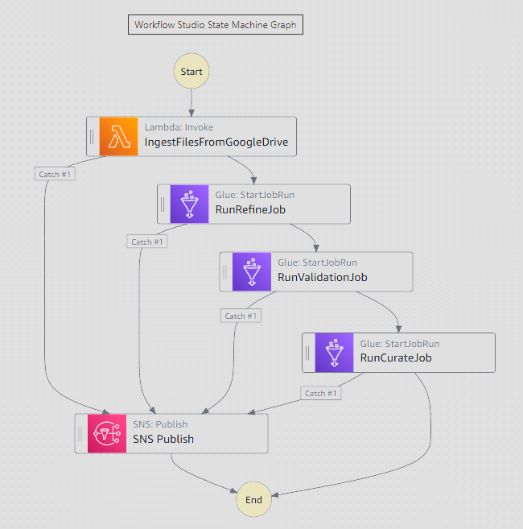
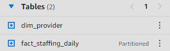
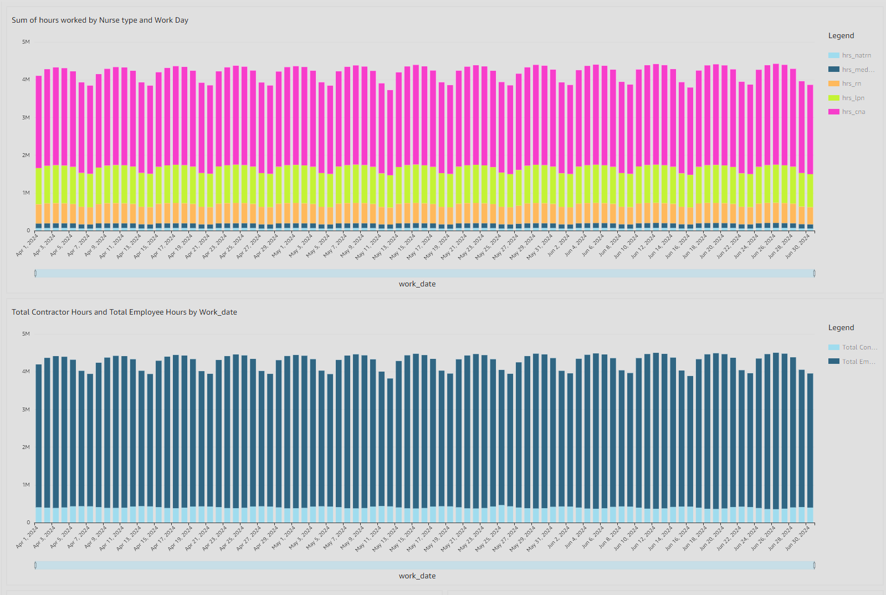
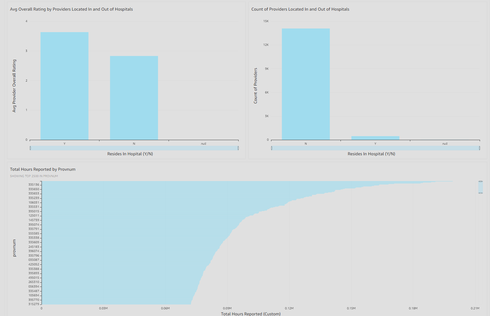
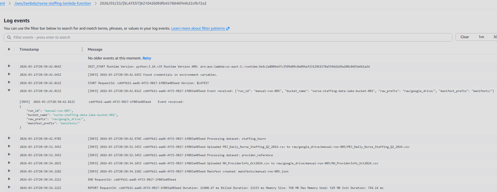
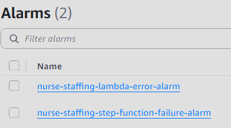
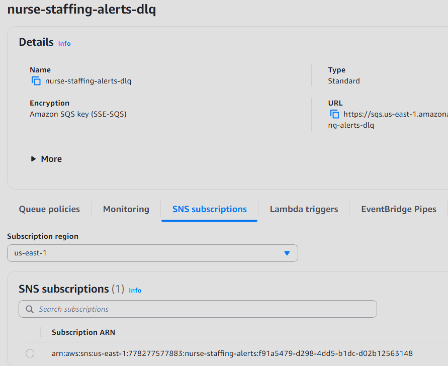

# AWS Serverless Data Lake Pipeline — Nurse Staffing Analytics

## Overview

This project implements a fully serverless, end-to-end data pipeline on AWS that ingests healthcare staffing data from Google Drive, processes it through a structured data lake architecture, enforces data quality rules, and exposes curated datasets for analytics.

The pipeline is designed to be:

- Scalable
- Resilient
- Observable
- Cost-efficient
- Production-ready

---

## Architecture Diagram

---

## High-Level Data Flow

1. AWS Lambda retrieves data from Google Drive  
2. Raw data is stored in Amazon S3  
3. AWS Step Functions orchestrates the pipeline  
4. AWS Glue processes data through multiple layers:  
   - Refined  
   - Validation  
   - Curated  
5. Amazon Athena provides querying capabilities  
6. Amazon QuickSight delivers dashboards  
7. CloudWatch + SNS handle monitoring and alerts  
8. SQS captures failed executions (dead-letter queue)  

---

## Tech Stack

- AWS Lambda
- Amazon S3
- AWS Step Functions
- AWS Glue
- Amazon Athena
- Amazon QuickSight
- Amazon CloudWatch
- Amazon SNS
- Amazon SQS
- AWS Secrets Manager
- Python

---

## Data Sources

### Nurse Staffing Data (Fact Table)

- One row per provider per day
- Includes staffing hours and patient census

### Provider Information Data (Dimension Table)

- Provider metadata
- Includes:
  - Provider ID (CCN)
  - Bed count
  - Hospital affiliation
  - Rating

---

## Data Lake Architecture

### Raw Layer

- Stores original CSV files
- Immutable
- Partitioned by ingestion date

### Refined Layer

- Standardized column names
- Explicit data typing
- Preserved leading zeroes for 'provnum' field
- Added metadata fields

### Curated Layer

- Analytics-ready datasets
- Stored as Parquet
- Partitioned by:
  - work_year
  - work_month

---

## Step Functions Orchestration

Pipeline flow:

1. Invoke ingestion Lambda
2. Run refine Glue job
3. Run validation Glue job
4. Run curated Glue job

### Features

- Retry logic
- Error handling (Catch)
- CloudWatch logging
- SQS dead-letter queue integration

---

## Lambda Ingestion

- Uses Google Drive API (OAuth)
- Credentials stored in Secrets Manager
- Streams large files (~214 MB)
- Optimized for memory and speed

---

## Glue ETL Jobs

### Refine Job

- Standardizes schema
- Casts data types
- Preserves identifiers
- Adds metadata columns

### Validation Job

- Referential integrity checks
- Null checks
- Schema validation

#### Key Finding

- 1,547 rows missing provider references

#### Solution

Instead of dropping data:

- Created inferred provider records
- Added flags:
  - provider_reference_gap_flag
  - provider_reference_source

### Curated Job

- Creates fact and dimension tables
- Derives partition columns
- Writes Parquet output

---

## Data Modeling

### Fact Table: fact_staffing_daily

- Grain: provider per day
- Contains staffing and census data

### Dimension Table: dim_provider

- Provider attributes
- Includes ratings, bed counts, hospital flags

---

## Athena Layer

- Tables created via manual DDL
- Partitioned by year and month
- Optimized for query performance

---

## QuickSight Dashboard

### Metrics

- Hours Reported by Nurse Type
- Employee vs Contractor Hours
- Avg Overall Rating by Providers Located In/Out of Hospitals
- Count of Providers Located In/Out of Hospitals
- Total Hours Reported by Provider

---

## Monitoring & Alerting

- CloudWatch logs for all services (only Lambda logs shown above)
- SNS alerts for failures

---

## Dead Letter Queue (SQS)

- Captures failed pipeline executions
- Stores error context for debugging
- Enables replay and recovery

---

## Key Design Decisions

### Step Functions vs Glue Workflows

Chosen for:
- Better error handling
- Native retries
- Cross-service orchestration

### Manual DDL vs Crawlers

Chosen for:
- Strict schema control
- Predictability
- Avoiding inference errors

### Handling Missing Data

Some provider information was missing, so instead of dropping:

- Created inferred dimension records
- Flagged them for transparency

---

## Scalability

- Lambda optimized for large file ingestion
- Glue scales horizontally
- Step Functions supports high concurrency

---

## Results

This pipeline successfully:

- Ingests external data securely
- Enforces data quality
- Handles edge cases
- Produces analytics-ready datasets
- Supports real-time business insights

---

## What This Project Demonstrates

- End-to-end data pipeline design
- AWS serverless architecture expertise
- Data modeling and warehousing
- Real-world data quality handling
- Observability and reliability patterns

---

## Future Improvements

- Add CI/CD pipeline (GitHub Actions)
- Implement data cataloging (Glue Data Catalog enhancements)
- Add automated data quality dashboards
- Introduce streaming ingestion for real-time processing

---

## Author

Built by Johnathon Smith, a data engineer focused on designing production-ready, scalable data systems.
